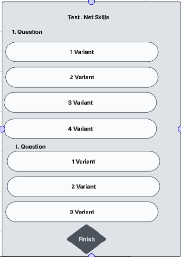

# SkillsGapIdentifier

## 📌 Project Name

Skills Gap Identifier

## 📝 Description

An AI tool that analyses project information and dynamically assesses team members' skills to evaluate their current skills and experience. Based on this data, it creates personalised training plans with recommended resources and approximate timelines for skill development.

The app has two modes:&#x20;

1\. Manager &#x20;

Pages:

&#x20;\- Add New Project

\- Result Talent skills with Recommendations with the ability to edit and add

\- Skills member by Projects with each team member&#x20;

\- Result Test by Skill

2\. Talent

\- Add Skills&#x20;

\- Result Talent skills with Recommendations with the ability to read and execute

\- Test by Skill

🚀 Features

- "Add New Project" Page

.png)
- "Add New Talent" Page

.png)
- Test by Skill

- "Result Talent skills with Recommendations
.png)

- For Managers "Result Member of Team
.png)

## 🧱 Tech Stack

- Frontend: React or Blazor
- Backend: .Net

